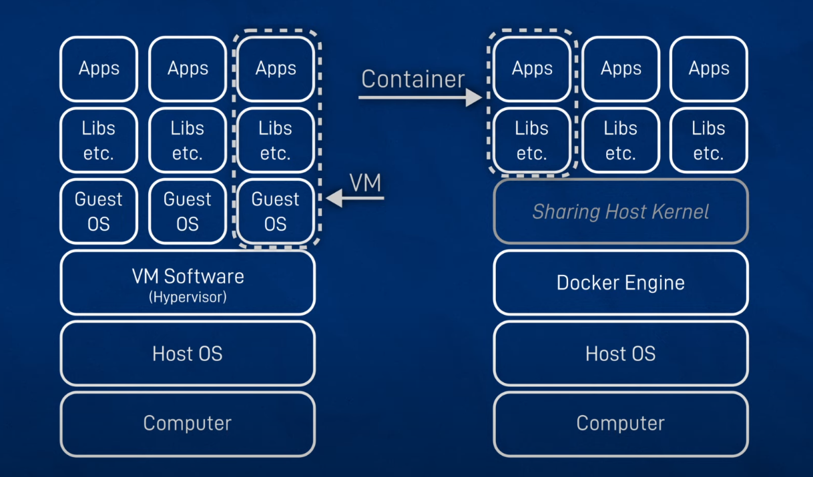

## Introduction to Docker for Robotics

When working with robotics systems, managing different software environments, dependencies, and toolchains can quickly become complex. That’s where **Docker** comes in — a powerful tool that helps us create isolated, reproducible, and portable environments for development, testing, and deployment.

Before we dive deep, let#s understand how docker is different from a virtual machine. 

Docker containers run fundamentally differently from virtual machines by sharing the host operating system's kernel rather than requiring separate guest operating systems. Here's how this architecture works:

## **Shared Kernel Architecture**

Unlike virtual machines that each run a complete guest operating system, Docker containers share the host OS kernel. This means all containers running on your system use the same underlying Linux kernel, which dramatically reduces resource overhead and improves performance.

## **Docker Engine as the Foundation**

The Docker Engine sits between your containers and the host OS, acting as the intermediary that manages container operations. When you run a Docker command, the Docker CLI communicates with the Docker Daemon through a REST API, which then handles the actual container management tasks like starting, stopping, and building containers.

## **Container Isolation Without Full Virtualization**

Containers achieve isolation using Linux kernel features like namespaces and control groups (cgroups) rather than hardware virtualization. Each container gets its own isolated view of system resources while still sharing the underlying kernel. This is similar to creating a sophisticated "chroot environment" that packages applications with their dependencies.

## **Platform Considerations**

On Windows and macOS, Docker Desktop runs a lightweight Linux virtual machine to provide the Linux kernel that containers need. This VM is optimized specifically for running containers and is much more efficient than traditional virtualization.

## **Key Benefits**

This architecture delivers several advantages over VMs:

- **Faster startup times**: Containers start almost instantly since the OS is already running[^3]
- **Better resource efficiency**: No need for separate guest operating systems[^3]
- **Smaller footprint**: Container images are much smaller than VM images[^3]
- **Higher performance**: Direct access to host kernel without hypervisor overhead[^3]

The diagram below illustrates this concept - containers share the host kernel and use Docker Engine for management, while VMs require complete guest operating systems and hypervisor software for each instance.

Now we know exactly how docker engine helps us to run containers on the local host system, let’s start with two fundamental concepts:

### Docker Images and Containers

- **Docker Image**  
  Think of a Docker image as a snapshot of a system — much like a disk image you might flash onto a Raspberry Pi (for example, an Ubuntu image). A Docker image contains everything your application needs to run: the operating system layers, libraries, dependencies, and your application code.

  You can start with an existing Docker image (e.g., one created by the ROS community) and customize it by writing a **Dockerfile** — a simple script that adds your additional dependencies, tools, or configurations. This results in a new image tailored to your project’s needs.

- **Docker Container**  
  A container is a running instance of a Docker image. You can think of it like booting up your laptop: you start it, run applications, make changes, and stop it when you’re done. Similarly, starting a Docker container launches a live, isolated environment where you can run and modify your code.

  If you stop and restart the same container, your changes (e.g., files you created, settings you tweaked) are still there — just like suspending and resuming your laptop. But if you **remove** the container and create a new one from the same image, it’s like flashing a fresh OS image onto your hard drive — you get a clean, unchanged system each time.

### Why Robotics Developers Should Use Docker

Docker offers several advantages that make it especially useful in robotics:

- **Run incompatible software or OS versions side-by-side**  
  Need ROS Foxy, Humble, or another ROS distribution on the same machine? Docker makes it easy without conflicts.

- **Standardize build and test environments**  
  Ensure your software builds and behaves the same way on every developer’s machine and CI system.

- **Standardize development environments**  
  Share a consistent workspace with your team so everyone’s on the same page, regardless of their host OS.

- **Simplify deployment**  
  Package your robot applications with their entire runtime environment, making deployment easier and less error-prone.

- **Infrastructure as code**  
  Capture your development and deployment setup as code (via Dockerfiles and docker-compose), enabling better automation and reproducibility.

- **Enable cloud development**  
  Easily move your robotics development to cloud platforms or virtual machines, with the same environment everywhere.
